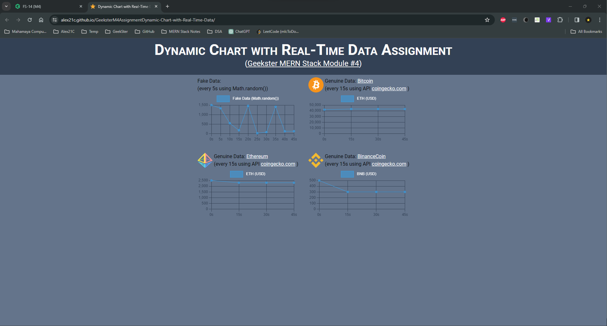

# Assignment, Dynamic Chart with Real-Time Data (Geekster MERN Stack Module 4)
Real time current prices of [Bitcoin](https://en.wikipedia.org/wiki/Bitcoin), [Ethereum](https://en.wikipedia.org/wiki/Ethereum) and [BinanceCoin](https://en.wikipedia.org/wiki/Binance) will be fetched and rendered on chart using graph.js and animation provided using anime.js


<!--  -->

# 1. How to set up the development environment on yours local machine
## 1.1 Installation (npm will automatically downlaod and install the required dependencies from package.json)
```bash
git clone https://github.com/Alex21c/GeeksterM4AssignmentDynamic-Chart-with-Real-Time-Data.git 
npm install 
```

## 1.2 Run 
```bash
npm run start
```

## 1.3 Build
```bash
npm run build
```

## 1.4 to clear parcel cache (useful during build process)
```bash
rm -rf .parcel-cache
```
# 2. Tech. Stack Used:

+ [API coingecko](https://www.coingecko.com/)
+ [Parcel.js JavaScript Bundler](https://parceljs.org/)
+ [Babel.js JavaScript Compiler](https://babeljs.io/)
+ [regenerator-runtime](https://www.npmjs.com/package/regenerator-runtime)
+ [Chart.js JavaScript Library](https://www.chartjs.org/)
+ [Anime.js JavaScript Library](https://animejs.com/)
+ [MVC Framework](https://en.wikipedia.org/wiki/Model%E2%80%93view%E2%80%93controller)
+ [HTML5](https://en.wikipedia.org/wiki/HTML5)
+ [CSS3](https://en.wikipedia.org/wiki/CSS)
+ [Tailwind CSS](https://tailwindcss.com/)
+ [JavaScript](https://en.wikipedia.org/wiki/JavaScript)
+ [Font Awesome Icons](https://fontawesome.com/icons)
+ [Google Fonts](https://fonts.google.com/)
+ [Git](https://en.wikipedia.org/wiki/Git)
+ [GitHub](https://github.com/)
+ [VS Code](https://code.visualstudio.com/)

# 3. Hosted Version of the Project:
[Geekster M4 Assignment&mdash;Dynamic Chart with Real-Time Data](https://alex21c.github.io/GeeksterM4AssignmentDynamic-Chart-with-Real-Time-Data/)

# 4. Author
[Abhishek kumar](https://www.linkedin.com/in/alex21c/), ([Geekster](https://geekster.in/) MERN Stack FS-14 Batch)
